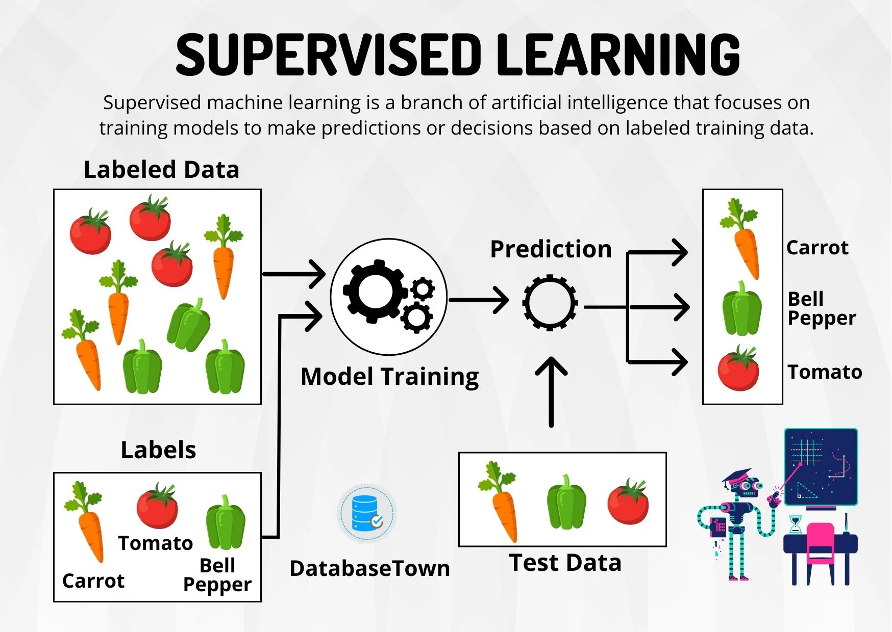

# Supervised Learning

Supervised learning is a machine learning paradigm where the algorithm is trained on a labeled dataset, meaning that the input data is paired with corresponding output labels. The goal is for the algorithm to learn the mapping between inputs and outputs, enabling it to make predictions or classifications on new, unseen data. During training, the algorithm adjusts its internal parameters based on the provided labeled examples, minimizing the discrepancy between its predictions and the actual labels. The supervised learning process involves iteratively refining the model's ability to generalize from the training data, ultimately allowing it to make accurate predictions on new instances. This approach is widely used for tasks such as regression, where the goal is to predict a continuous value, and classification, where the aim is to categorize input data into predefined classes or labels.

Please look though this files to learn more about it!